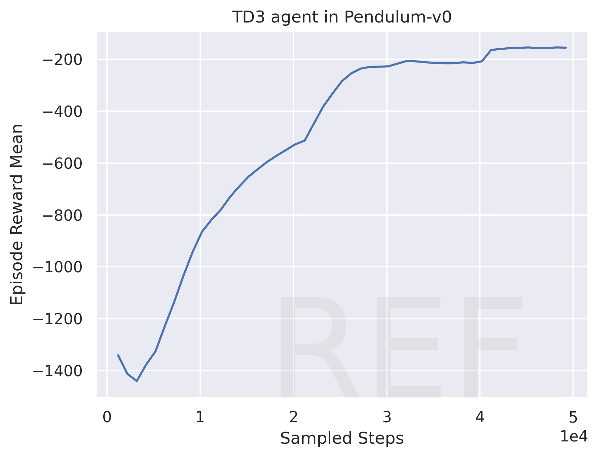
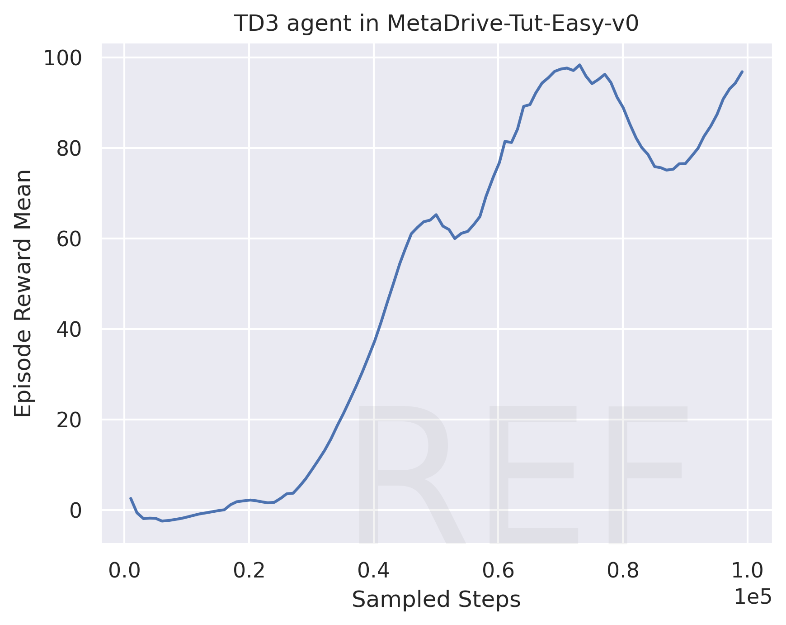
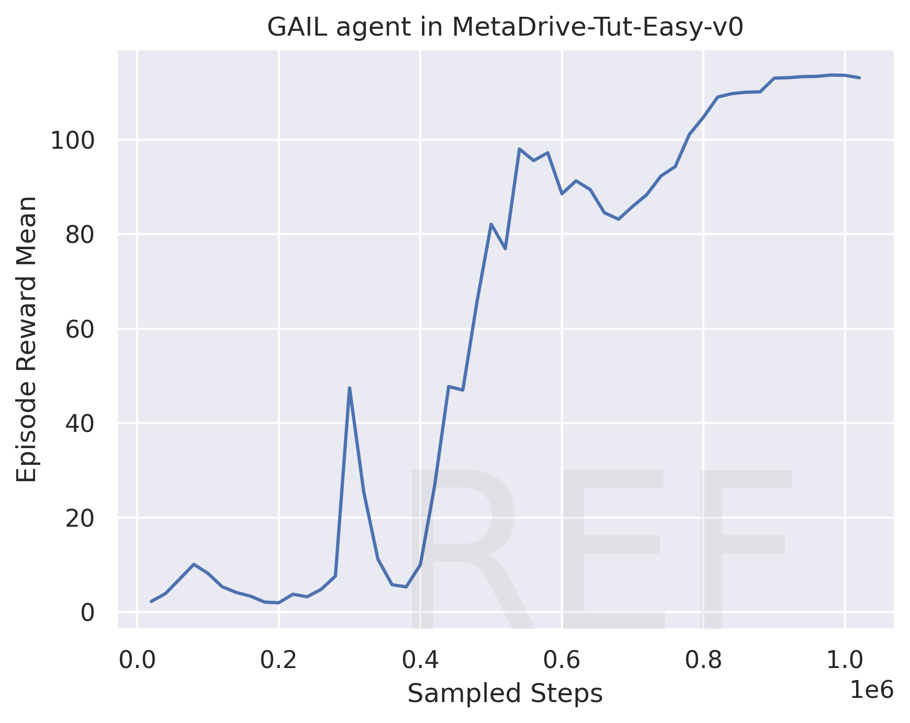
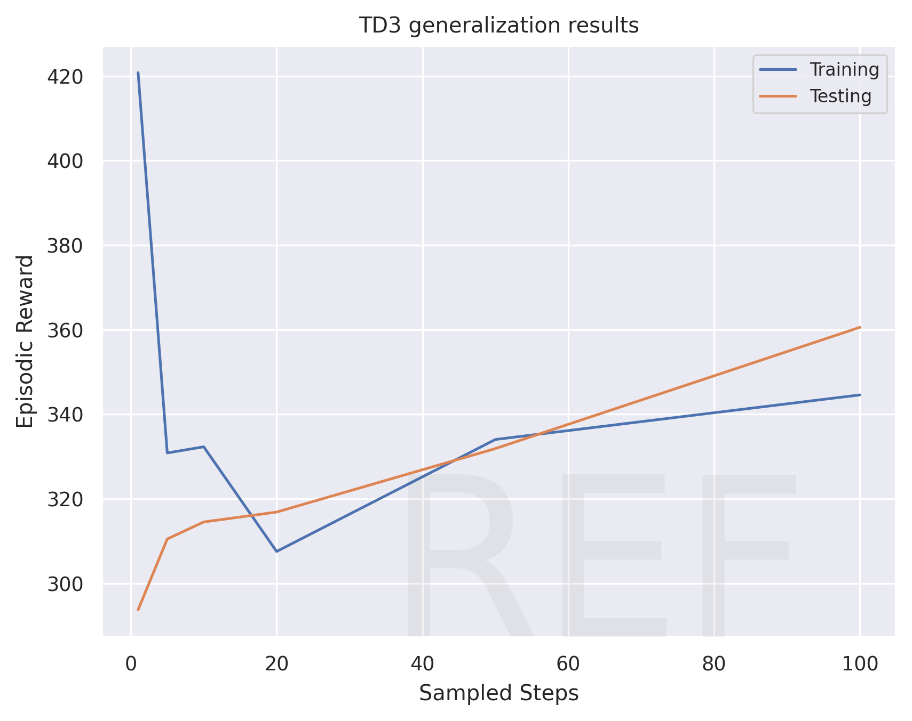
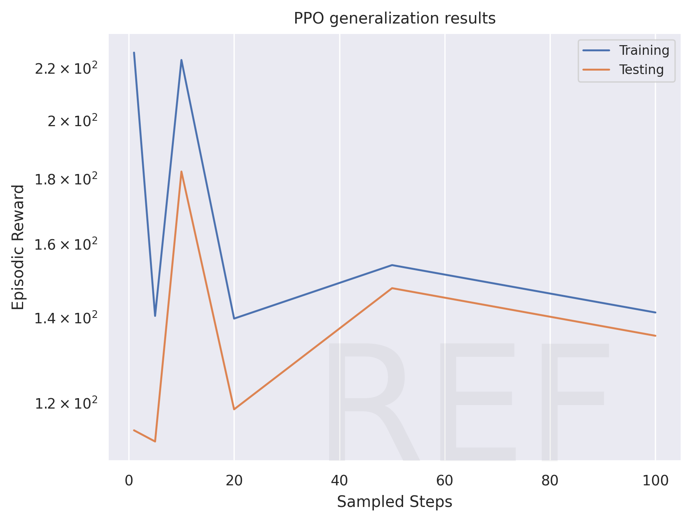
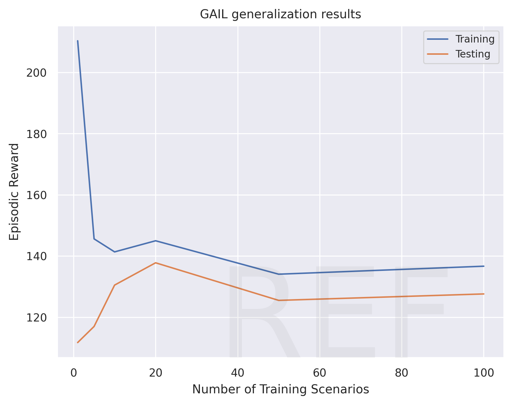

# Assignment 3 of CS269 2022 Fall

**NAME:** Yingqi Gao

**UID:** 705435843

## Learning curves of TD3

(20 points are given to the code.)

### TD3 in Pendulum-v0

(5 points)

### TD3 in MetaDrive-Tut-Easy-v0

(5 points)

## Learning curves of PPO

(15 points are given to the code.)

### PPO in CartPole

(2 points)

[TODO: Replace to your figure]

### PPO in MetaDrive-Tut-Easy-v0

(3 points)

[TODO: Replace to your figure]

## Learning curves of GAIL

(15 points are given to the code.)

### GAIL in MetaDrive-Tut-Easy-v0

(5 points)

## Generalization Experiment

In this section, you need to draw one figure
whose X-coordinate represents "the number of training scenes" and 
Y-coordinate represents "the episodic reward".

We expect two lines in the figure, showing the final training performance and 
the test performance varying with the number of training scenes. 

You can refer to the Figure 8 of the paper of  [MetaDrive paper](https://arxiv.org/pdf/2109.12674.pdf) 
to see the expected curves. [ProcGen paper](http://proceedings.mlr.press/v97/cobbe19a/cobbe19a.pdf) is also highly relevant.

Choosing one algorithm, you should train agents in `MetaDrive-Tut-[1,5,10,20,50,100]Env-v0` environments and test all agents in `MetaDrive-Tut-Test-v0`.

Please discuss the figure you get.

### The generalization curves

(20 points are given to the figure.)

#### TD3

Yes, it looks normal. The training reward is relatively high when the trainig environment is simple and gets lower. It is harder to train when the environment is more and more complicated. And since TD3 uses clipped double-Q learning, delayed policy updates, and target policy smoothing to avoid overestimation of the Q-values, it is normal to see the training and testing rewards hold close but slightly different relationships when the training environment gets more and more complicated. 

#### PPO

#### GAIL

Yes, the above two figures for PPO and GAIL look normal. They both share high rewards for simple training environment. And they both have testing rewards always lower than training rewards no matter how complicated the environment is. 

[TODO]: Discuss the figure. Does it look normal? If not, why? Do you have any solution?

## Discussion

In this section, you are free to write down your ideas and discussion. 
You can also leave this section blank.
If you conduct extra experiments, please record them here.

